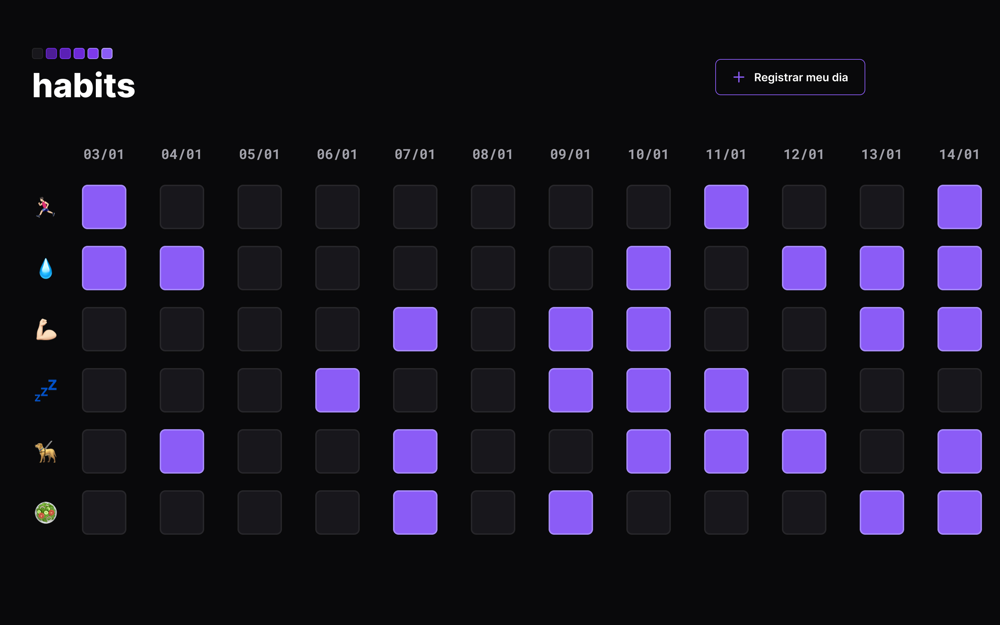

<h1 align="center"> NLW Setup </h1>

Evento exclusivo e gratuito, promovido pela Rocketseat para ensino de tecnologias WEB.

  <a href="#-tecnologias">Tecnologias</a>&nbsp;&nbsp;&nbsp;|&nbsp;&nbsp;&nbsp;
  <a href="#-projeto">Projeto</a>&nbsp;&nbsp;&nbsp;|&nbsp;&nbsp;&nbsp;
  <a href="#-layout">Layout</a>&nbsp;&nbsp;&nbsp;|&nbsp;&nbsp;&nbsp;
  <a href="#memo-licença">Licença</a>

  

 

  

## 🚀 Tecnologias

Esse projeto foi desenvolvido com as seguintes tecnologias:

- HTML e CSS
- JavaScript
- Git e Github

## 💻 Projeto

O Rastreador de Hábitos é um projeto que permite o acompanhando de atividades ao longo dos dias.

[Clique aqui para acessar](https://marciorobertomr.github.io/NLW-Setup/)

## 🔖 Layout

Você pode visualizar o layout do projeto através [DESSE LINK](https://www.figma.com/community/file/1195327109778210238). É necessário ter conta no [Figma](https://figma.com) para acessá-lo.

## 📄 Biblioteca

Para o desenvolvimento, foi utilizada uma biblioteca criada pela Rocketseat específica para o evento.

[Clique aqui para acessar a documentação](https://maykbrito.github.io/libs/NLWSetup/documentation/NLWSetup.html)

## :memo: Licença

Esse projeto está sob a licença MIT.
